<!-- Generated by StrongAIAutoDoc 20260523 -->

Ripstop is a TypeScript guardrails package that runs policy checks in Git hooks and CI. At the package root, the CLI orchestrates operations like running checks, generating RIPSTOP.md documentation, listing/explaining checks, and recovering configuration history. Configuration is loaded from YAML, optionally extended from presets, validated with Zod, and hashed deterministically for freshness and auditing. A Git adapter provides file selections, diffs, and commit messages. The Runner selects checks from a registry, executes them with consistent context, and aggregates findings. Reporters render results for humans or machines, while JSONL audit and witness logs provide traceability and recovery.

```mermaid
C4Component
title Ripstop Package Root - Rolled-up C4 Component Diagram

System_Ext(User, "Developer / CI", "Invokes CLI locally (hooks) or in CI pipelines")
System_Ext(GitCLI, "Git CLI", "Provides repo state, diffs, commit/push context")
System_Ext(FileSystem, "Filesystem", "Reads config and repo files; writes docs and logs")
System_Ext(Stdout, "process.stdout", "Console output for reports and commands")
System_Ext(ClaudeCode, "Claude Code Settings", "Consumes settings fragment to enforce deny rules")
System_Ext(jsyaml, "js-yaml", "YAML parsing")
System_Ext(zod, "Zod", "Schema validation/defaulting")
System_Ext(crypto, "Node crypto", "SHA-256 hashing")
System_Ext(picomatch, "picomatch", "Glob matching for guards/exemptions")

Boundary(PackageRoot, "ripstop (package)") {

  Component(index, "index.ts", "Public API Facade", "Re-exports config, checks, registry, and Runner APIs")

  Boundary(CLI, "CLI Commands (root modules)") {
    Component(cli, "cli.ts", "CLI Entry", "Parses argv, dispatches subcommands, sets exit codes")
    Component(generateMdCmd, "generateMd.ts", "Command: generate-md", "Generates/validates RIPSTOP.md and optional Claude settings fragment")
    Component(recoverCmd, "recover.ts", "Command: recover", "Prints config history snapshots from witness log")
  }

  Component(runner, "Runner.ts", "Run Orchestrator", "Selects checks, runs them, aggregates findings, writes audit/witness logs")

  Boundary(Config, "config/") {
    Component(configLoad, "load.ts", "Config Loader", "Loads YAML, resolves presets, deep-merges, validates to IRipstopConfig")
    Component(configSchema, "schema.ts", "Config Schema", "Zod schemas + inferred types for IRipstopConfig")
    Component(configHash, "configHash.ts", "Config Hash", "Canonical stringify + SHA-256 hash for resolved config")
  }

  Boundary(Checks, "checks/") {
    Component(checkTypes, "types.ts", "Checks Contracts", "ICheck/ICheckContext/IFinding; triggers and modes")
    Component(checkRegistry, "registry.ts", "Check Registry", "Registers built-ins; selects checks per trigger")
    Component(checkPlugins, "Built-in checks", "ICheck plugins", "History/Path/PII/TestSkip/RIPSTOP freshness/Reflog witness")
    Component(selfProtection, "selfProtectionPaths.ts", "Self-Protection Utility", "Canonical protected globs and matching helpers")
  }

  Boundary(Git, "git/") {
    Component(gitAdapter, "Git.ts", "Git Adapter", "Lists files, reads blobs, computes diffs, reads commit message")
  }

  Boundary(Generators, "generators/") {
    Component(mdGen, "markdown.ts", "RIPSTOP.md Generator", "Renders documentation; embeds config hash; format adapters")
    Component(claudeGen, "claudeDenySettings.ts", "Claude Deny Settings Generator", "Emits settings fragment denying policy file edits")
  }

  Boundary(Reporters, "reporters/") {
    Component(reporterFactory, "Reporter.ts", "Reporter Factory/Contract", "IRunReport/IReporter and createReporter(format)")
    Component(humanReporter, "human.ts", "Human Reporter", "Line-oriented terminal output")
    Component(jsonReporter, "json.ts", "JSON Reporter", "Stable JSON serialization")
  }

  Boundary(Logs, "logs/") {
    Component(jsonlWriter, "JsonlWriter", "JSONL Writer", "Append-only JSON lines persistence")
    Component(auditWriter, "AuditWriter", "Audit Log Writer", "Normalizes/enriches guardrail audit events")
    Component(witnessWriter, "WitnessWriter", "Witness Log Writer", "Enriches witness events for replay/recovery")
  }
}

%% CLI flows
Rel(User, cli, "Runs commands", "argv")
Rel(cli, configLoad, "Loads resolved config")
Rel(cli, gitAdapter, "Opens repo and collects inputs")
Rel(cli, checkRegistry, "Builds default registry")
Rel(cli, runner, "Runs checks (check command)")

Rel(cli, generateMdCmd, "Dispatches")
Rel(generateMdCmd, configLoad, "Loads config")
Rel(generateMdCmd, configHash, "Hashes resolved config")
Rel(generateMdCmd, mdGen, "Generates RIPSTOP.md content")
Rel(generateMdCmd, claudeGen, "Generates .claude/settings.ripstop.json (claude format)")

Rel(cli, recoverCmd, "Dispatches")
Rel(recoverCmd, configLoad, "Loads config to locate logs")
Rel(recoverCmd, witnessWriter, "Reads witness log output format", "JSONL entries")

%% Runner execution
Rel(runner, checkRegistry, "Selects checks by trigger")
Rel(checkRegistry, checkPlugins, "Provides selected checks")
Rel(checkPlugins, checkTypes, "Implements contracts; emits findings")
Rel(runner, gitAdapter, "Requests files/diffs/commit message")
Rel(gitAdapter, GitCLI, "Invokes", "child_process execFile")
Rel(runner, reporterFactory, "Builds reporter and writes report")
Rel(reporterFactory, humanReporter, "Creates when format=human")
Rel(reporterFactory, jsonReporter, "Creates when format=json")
Rel(humanReporter, Stdout, "Writes")
Rel(jsonReporter, Stdout, "Writes")

%% Logging
Rel(runner, auditWriter, "Writes findings/bypasses/exemptions")
Rel(runner, witnessWriter, "Writes witness events (config snapshots)")
Rel(auditWriter, jsonlWriter, "Appends via")
Rel(witnessWriter, jsonlWriter, "Appends via")
Rel(jsonlWriter, FileSystem, "Appends files")

%% Config internals and dependencies
Rel(configLoad, FileSystem, "Reads .guardrails.yaml and presets")
Rel(configLoad, jsyaml, "Parses YAML")
Rel(configLoad, configSchema, "Validates/normalizes")
Rel(configSchema, zod, "Defines/executes schemas")
Rel(configHash, crypto, "Computes SHA-256")

%% Generators outputs
Rel(mdGen, FileSystem, "Writes RIPSTOP.md")
Rel(claudeGen, FileSystem, "Writes .claude/settings.ripstop.json")
Rel(claudeGen, ClaudeCode, "Provides deny rules for merge/enforcement", "JSON")

%% Checks utilities
Rel(checkPlugins, selfProtection, "Matches protected paths and guardrail files")
Rel(selfProtection, picomatch, "Glob matching")
Rel(checkPlugins, zod, "Per-check config schemas")
```

Key components are coordinated by `cli.ts`, which parses commands and builds the runtime graph: Git adapter, loaded configuration, default check registry, Runner, and reporters. `config/load.ts` resolves YAML plus preset inheritance, then validates via `config/schema.ts`; `config/configHash.ts` produces a stable digest used by documentation freshness and witness logging. `Runner.ts` is the execution hub: it asks `git/Git.ts` for the chosen file selection and diffs, selects checks from `checks/registry.ts` by trigger, applies effective modes (warn/enforce), runs each `ICheck`, and aggregates `IFinding` results. It also creates `logs/AuditWriter` and `logs/WitnessWriter` to append JSONL records for traceability and later recovery. Output is standardized through `reporters/Reporter.ts`, which selects human or JSON formatting. `generators/markdown.ts` and `generators/claudeDenySettings.ts` produce auditable artifacts (RIPSTOP.md and deny settings) written to the repo.