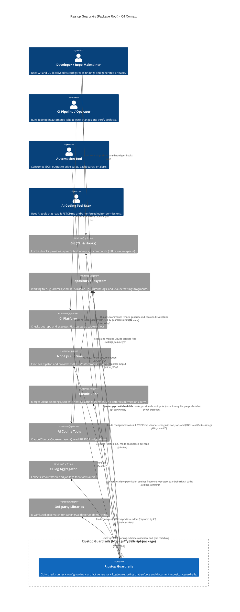

<!-- Generated by StrongAIAutoDoc 20260523 -->

Ripstop Guardrails is a TypeScript/Node.js package that enforces repository change policies across local Git workflows and CI. Developers encounter it via Git hooks (pre-commit, commit-msg, pre-push, pre-rebase) and via a CLI that can run checks, list/explain policies, generate RIPSTOP.md documentation, and recover configuration history. In CI, it runs as a job step to gate merges and publish machine-readable results. The package inspects staged files, diffs, commit messages, and push metadata using the Git CLI and filesystem access, then reports findings to stdout and append-only JSONL logs. It also generates AI-tool guardrail artifacts and Claude Code deny-permission settings.

### Key interactions
Git hooks and CI are the primary entry points. In local workflows, Git triggers Ripstop during pre-commit/commit-msg/pre-push/pre-rebase; the runner uses the Git CLI to compute branch context, enumerate staged files, and obtain diffs or staged content. Ripstop reads repository configuration (.guardrails.yaml) and documentation (RIPSTOP.md) from the filesystem, validates and normalizes config with Zod, parses YAML via js-yaml, and applies glob-based policy matching via picomatch. Results are rendered through reporters to stdout (human text or JSON), enabling both developer feedback and downstream automation that parses JSON. For traceability and recovery, Ripstop appends audit and witness events as JSONL files under the repo. The generator writes RIPSTOP.md with an embedded configuration hash and emits .claude/settings.ripstop.json so Claude Code merges and enforces permissions.deny, discouraging automated weakening of guardrails.