<!-- Generated by StrongAIAutoDoc 20260523 -->

This directory implements a suite of “guardrail” checks used in Git hooks and CI to prevent risky or non-compliant changes. Each check is an `ICheck` plugin that validates configuration (typically via Zod), inspects repository context (files, diffs, commit message, push payload), and emits normalized `IFinding` results with mode-dependent severity (warn vs enforce). A registry assembles and selects checks per trigger. Supporting utilities provide shared contracts (`types`) and consistent glob/self-protection path matching to ensure configuration and generated documentation remain trustworthy.

```mermaid
C4Component
title Guardrails Checks (TypeScript directory) - C4 Component Diagram

%% Boundary for this directory
Boundary(dir, "Guardrails Checks Directory") {

  Component(types, "types.ts", "Types / Contracts", "Defines ICheck, ICheckContext, IFinding, Trigger/Mode enums, push/file models, writers")

  Component(registry, "registry.ts", "Check Registry", "Registers built-in checks and selects checks to run per trigger")

  Component(historyGuard, "HistoryGuard.ts", "Check: History Guard", "Detects protected-branch deletions and force-updates in pre-push input")
  Component(pathGuard, "PathGuard.ts", "Check: Path Guard", "Guards change-controlled paths; requires approval trailer in commit message")
  Component(pii, "Pii.ts", "Check: PII Scanner", "Regex scans file contents for PII (pre-commit/CI)")
  Component(testSkip, "TestSkip.ts", "Check: Test Skip Detector", "Detects newly added test-skip annotations in diffs; can require ticket")
  Component(ripstopFresh, "RipstopMdFresh.ts", "Check: RIPSTOP.md Freshness", "Ensures RIPSTOP.md exists and matches resolved configuration hash")
  Component(reflogWitness, "ReflogWitness.ts", "Check: Reflog Witness", "Writes witness records hashing guardrails config and RIPSTOP.md")

  Component(selfProt, "selfProtectionPaths.ts", "Self-Protection Paths Utility", "Defines canonical protected globs and consistent matching helpers")
}

%% External dependencies/systems
System_Ext(git, "Git", "Provides hook inputs, branch info, diffs, and repository state")
System_Ext(fs, "Filesystem", "Reads/writes repository files and logs")
System_Ext(ci, "CI Runner", "Invokes checks in CI trigger")
System_Ext(zod, "Zod", "Config schema validation and defaults")
System_Ext(picomatch, "picomatch", "Glob matching for paths/branches and exemptions")
System_Ext(nodeCrypto, "Node crypto", "SHA-256 hashing")
System_Ext(nodeChildProc, "Node child_process", "execFile for git queries")

%% Registry uses/hosts checks
Rel(registry, historyGuard, "Registers and selects")
Rel(registry, pathGuard, "Registers and selects")
Rel(registry, pii, "Registers and selects")
Rel(registry, testSkip, "Registers and selects")
Rel(registry, ripstopFresh, "Registers and selects")
Rel(registry, reflogWitness, "Registers and selects")

%% Checks depend on shared types
Rel(historyGuard, types, "Implements ICheck; emits IFinding")
Rel(pathGuard, types, "Implements ICheck; emits IFinding")
Rel(pii, types, "Implements ICheck; emits IFinding")
Rel(testSkip, types, "Implements ICheck; emits IFinding")
Rel(ripstopFresh, types, "Implements ICheck; emits IFinding")
Rel(reflogWitness, types, "Implements ICheck; emits IFinding")
Rel(registry, types, "Uses ICheck and Trigger")

%% Utilities used by checks
Rel(pathGuard, selfProt, "Matches protected paths; detects self-protection files")
Rel(selfProt, picomatch, "Delegates true glob matching")

%% Config validation
Rel(historyGuard, zod, "Validates/normalizes config")
Rel(pathGuard, zod, "Validates/normalizes config")
Rel(pii, zod, "Validates/normalizes config")
Rel(testSkip, zod, "Validates/normalizes config")
Rel(ripstopFresh, zod, "Validates/normalizes config")
Rel(reflogWitness, zod, "Validates/normalizes config")

%% Glob matching
Rel(historyGuard, picomatch, "Compiles protected branch globs")
Rel(pii, picomatch, "Compiles exemption globs")

%% Interaction with Git/FS/CI
Rel(ci, registry, "Requests checks for CI trigger and runs them")
Rel(git, historyGuard, "Provides pre-push stdin ref updates")
Rel(git, testSkip, "Provides diffs for added-line scanning")
Rel(git, reflogWitness, "Provides current branch name")
Rel(fs, pii, "Reads file contents to scan")
Rel(fs, ripstopFresh, "Reads RIPSTOP.md for hash comparison")
Rel(fs, reflogWitness, "Reads guardrails config and RIPSTOP.md; appends witness log")
Rel(reflogWitness, nodeCrypto, "Computes SHA-256 hashes")
Rel(reflogWitness, nodeChildProc, "Queries git for branch via execFile")
```

### Key components
`types.ts` is the contract hub: all checks implement `ICheck`, consume `ICheckContext` (files, diffs, commit message, push payload, config), and return `IFinding` with standardized severities and rule IDs. `registry.ts` assembles built-in checks and selects the right subset based on the current `Trigger`, validating requested check names early. The guard checks focus on different risk surfaces: `HistoryGuard` parses pre-push ref updates to detect protected-branch deletions/force pushes; `PathGuard` blocks edits to protected paths unless an approval trailer is present, using `selfProtectionPaths` to apply stronger messaging to guardrails files; `Pii` scans file contents with configurable regexes and exemptions; `TestSkip` inspects added diff lines for skip annotations. `ReflogWitness` and `RipstopMdFresh` provide configuration integrity: hashing/recording state and ensuring `RIPSTOP.md` matches the resolved configuration.