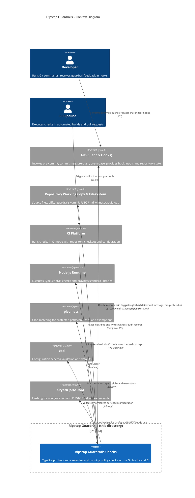

<!-- Generated by StrongAIAutoDoc 20260523 -->

Ripstop Guardrails is a TypeScript-based suite of Git hook and CI checks that prevents risky repository changes and enforces policy before code is accepted. It runs in local developer workflows (pre-commit, commit-msg, pre-push, pre-rebase) and in CI, analyzing staged files, diffs, commit messages, and push metadata. It also snapshots configuration state for later forensic recovery. The system interacts primarily with Developers, CI pipelines, Git clients/hooks, the local repository filesystem, and Git itself to determine branch context and validate push operations.

### Key components and external interactions
The system is invoked by Git hooks and CI, then uses a registry to select checks appropriate for each trigger (pre-commit, commit-msg, pre-push, pre-rebase, CI). It reads repository content and metadata from the filesystem (changed files, optional diffs, .guardrails.yaml, RIPSTOP.md) and emits findings as warnings or errors depending on enforce mode. HistoryGuard consumes pre-push stdin to detect protected-branch deletions and force updates. PathGuard validates edits to protected paths and inspects commit message trailers for approvals. PII and TestSkip scan file contents or added diff lines. ReflogWitness snapshots configuration hashes (and optionally content) and records them to a witness log, querying Git for branch context. Configuration parsing depends on zod, while glob matching relies on picomatch, and hashing uses Node crypto.