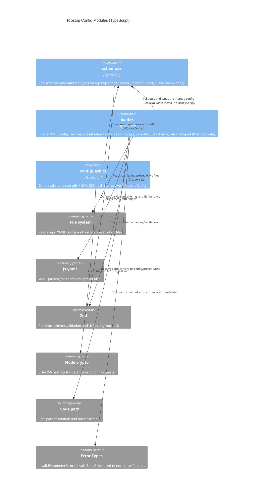

<!-- Generated by StrongAIAutoDoc 20260523 -->

This directory provides Ripstop configuration infrastructure: defining the canonical schema, loading YAML configuration with optional inheritance from built-in presets, and producing deterministic hashes for resolved configs. Together, these modules ensure configuration is discoverable, safely parsed and validated, normalized with defaults, merged predictably, and comparable over time (e.g., to detect whether documentation like RIPSTOP.md is up to date). The result is a typed, stable IRipstopConfig for downstream checks and tooling.

Key components: `schema.ts` is the contract: it defines Zod schemas for repo metadata, check configuration, reporting, bypass rules, and preset extension, and exposes the inferred `IRipstopConfig` type for consumers. `load.ts` is the orchestrator: it reads YAML, optionally follows `extends` into built-in presets (restricted to a fixed prefix), deep-merges (arrays replaced), and validates via `RipstopConfigSchema`, converting failures into normalized parameter/state errors. `configHash.ts` adds stability: it canonicalizes the fully resolved config with key-sorted stringification (normalizing undefined to null) and hashes it with SHA-256, enabling reliable freshness checks.