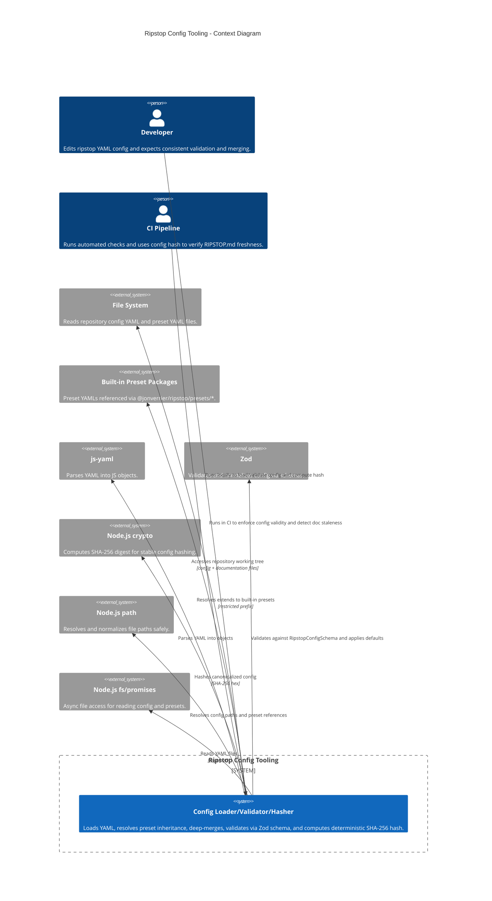

<!-- Generated by StrongAIAutoDoc 20260523 -->

Ripstop configuration tooling loads, validates, merges, and fingerprints repository configuration so automation can reliably decide whether documentation such as RIPSTOP.md is up to date. It is used by developers and CI pipelines that need deterministic results across machines and runs. The system reads YAML configuration files from a repository, may inherit from built-in preset YAMLs, validates using schemas, and produces a stable SHA-256 hash for change detection.

Key components and external interactions center on reliably turning YAML into a validated, typed configuration and a deterministic fingerprint. The tooling reads repository YAML through Node.js fs/promises and resolves paths with Node.js path to avoid unsafe or inconsistent resolution. YAML parsing is delegated to js-yaml, and structural validation plus defaults are enforced with Zod schemas to produce an IRipstopConfig. Preset inheritance is supported by recursively loading built-in preset YAMLs (restricted to the @jonverrier/ripstop/presets/ prefix) and deep-merging with repository overrides. Finally, Node.js crypto computes a SHA-256 hash over a canonical, stable string form for freshness checks.