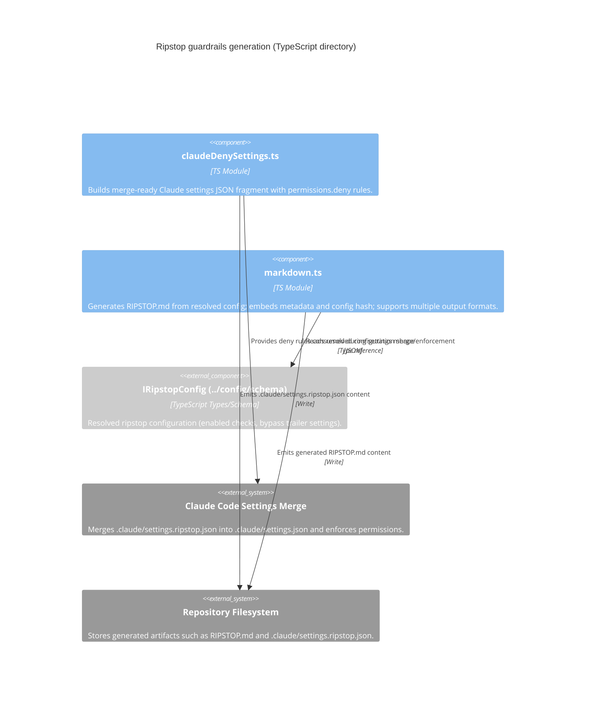

<!-- Generated by StrongAIAutoDoc 20260523 -->

These modules generate “ripstop” artifacts that harden a repository’s agent guardrails and make them auditable. One module emits a merge-ready Claude Code settings fragment that denies edits to key policy files, preventing self-weakening automation. The other module renders the human-facing RIPSTOP.md from a resolved configuration, embedding metadata and a config hash for freshness checks, and can adapt output for different AI tools’ preferred formats.

Key components: markdown.ts is the primary renderer for RIPSTOP.md. It consumes the resolved IRipstopConfig shape, converts enabled checks into a readable “what this repo blocks” section, and embeds generation metadata (time, package version) plus a SHA-256 config hash. It also provides extractEmbeddedConfigHash() and a regex constant to detect freshness. It can rewrite/wrap output for tool-specific formats (Claude, Cursor, Codex, Amazon Q). claudeDenySettings.ts outputs a minimal JSON fragment that denies edits/writes to guardrail-defining files (RIPSTOP.md, .guardrails/, and Claude settings), intended for Claude Code’s settings merge and enforcement.