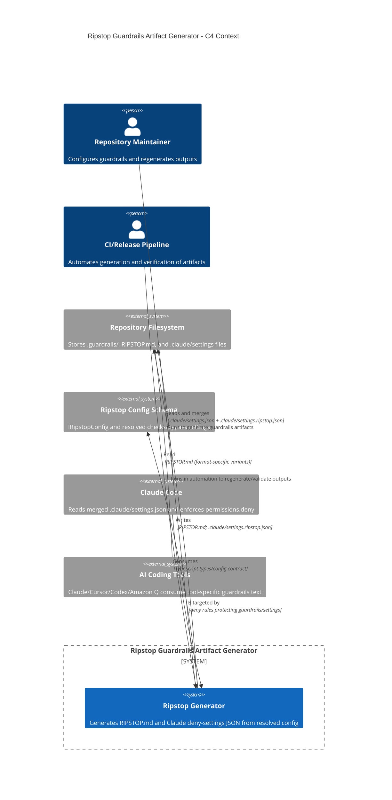

<!-- Generated by StrongAIAutoDoc 20260523 -->

This system generates and protects repository “RIPSTOP” guardrails artifacts for AI-assisted coding workflows. It produces a tool-tailored RIPSTOP.md document from a resolved configuration and emits Claude Code deny-permission settings that discourage automated weakening of guardrails. The primary users are repository maintainers and CI or release scripts that regenerate artifacts. It interacts with Claude Code’s settings merge behavior, various AI tool formats, and the repository filesystem where guardrails and settings are stored.

Key components and interactions center on two outputs. The generator writes RIPSTOP.md to the repository filesystem, embedding generation metadata and a SHA-256 configuration hash that downstream checks can extract and compare for freshness. It also writes a Claude Code settings fragment (.claude/settings.ripstop.json) containing permissions.deny rules that block edits/writes to guardrails-critical paths (the primary guardrails file, .guardrails/, RIPSTOP.md, and Claude settings). Claude Code then merges this fragment into its effective settings and enforces the deny list. AI tools consume RIPSTOP.md variants (Claude wrapper, Cursor headings, Codex/Amazon Q prefixes).