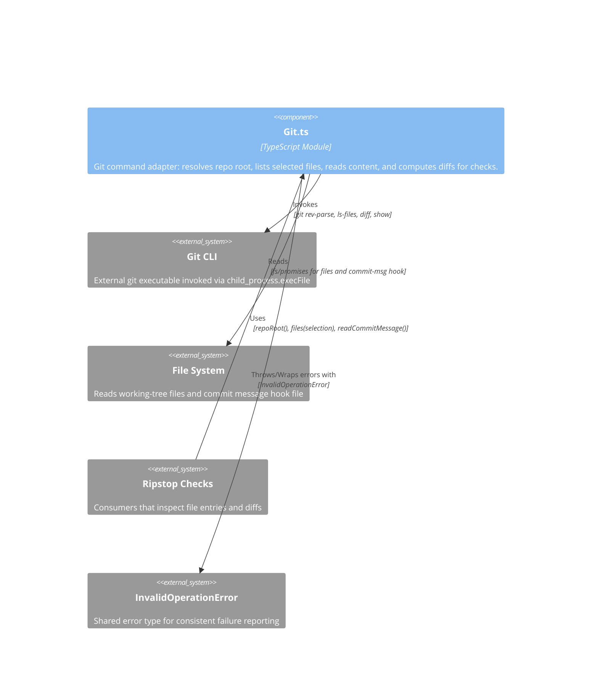

<!-- Generated by StrongAIAutoDoc 20260523 -->

This directory provides a small Git command adapter used by Ripstop checks to inspect repository state. It runs targeted Git commands and normalizes their outputs into file-entry records that can be analyzed for file content and diffs. It supports selecting all tracked files, staged changes, or changes relative to a reference range, and includes a helper to read the commit message used by hooks.

### Key components
**Git.ts (Git adapter)** encapsulates all Git interactions needed by Ripstop checks. It resolves the repository root via `git rev-parse`, then produces `IFileEntry` objects from one of three `FileSelection` modes: tracked working-tree files, staged changes, or diffs against a reference range (`ref...HEAD`). For staged and diff modes it computes name-status and per-file diffs, reading staged blobs via `git show :path` and handling the empty-tree SHA for initial comparisons. It also reads the commit message hook file from disk.