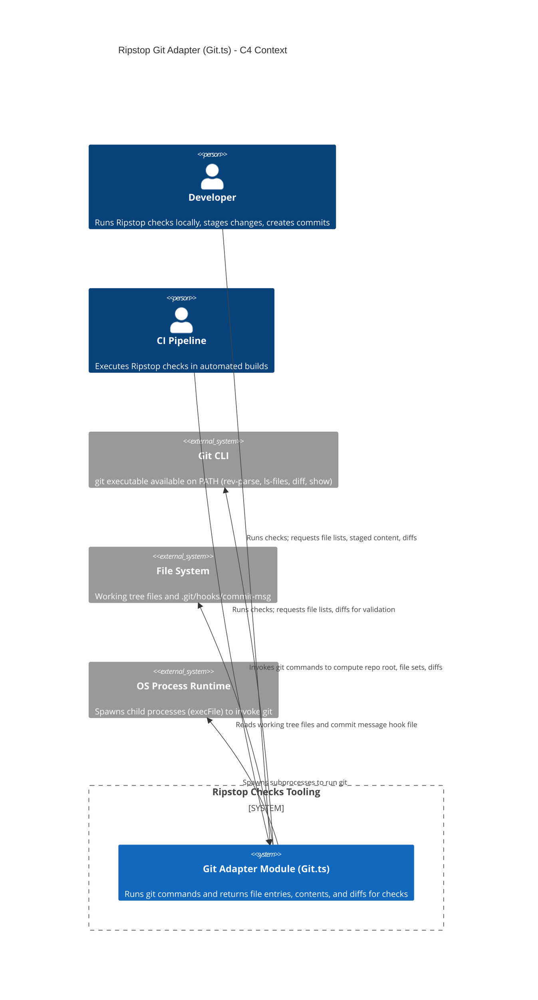

<!-- Generated by StrongAIAutoDoc 20260523 -->

Ripstop’s Git adapter module provides a thin, consistent interface for checks that need to inspect repository files, staged content, and diffs. It interacts primarily with developers and CI jobs running checks, and depends on the local Git CLI to query repository state. It also reads files from the working tree and hook scripts (commit-msg) from disk to support commit-time validation workflows.

The Git adapter’s primary dependency is the external Git CLI, invoked via child_process.execFile, to compute repository root (rev-parse), enumerate tracked files (ls-files), and derive staged or ref-based change sets (diff --cached, diff ref...HEAD). For content, it reads working tree files directly from the file system and uses git show :path to extract staged versions. It also reads the commit-msg hook file to obtain commit message text for validation. Errors are normalized through a shared InvalidOperationError.