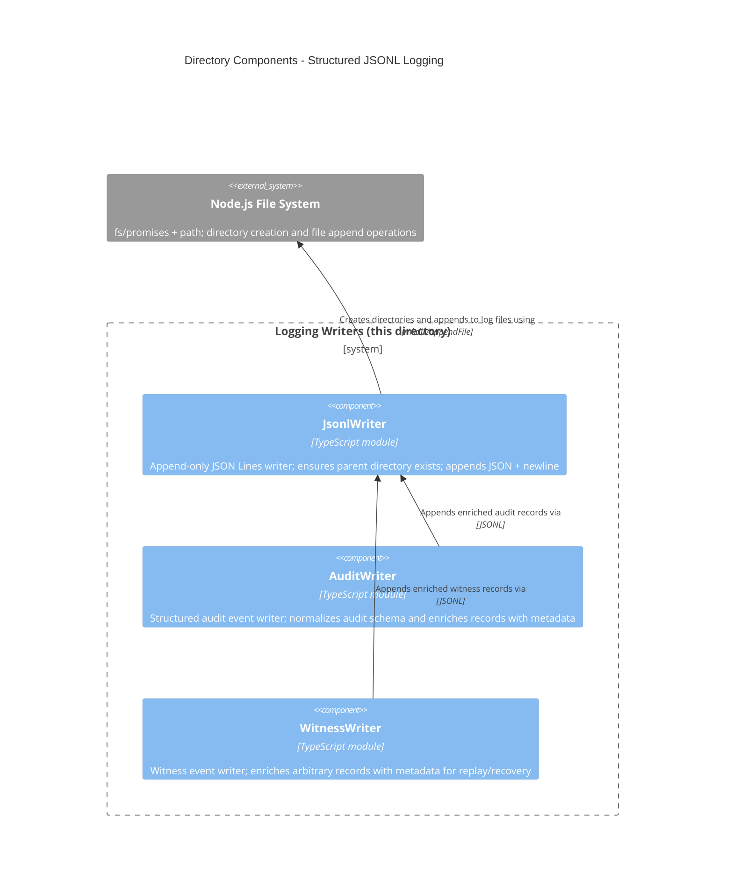

<!-- Generated by StrongAIAutoDoc 20260523 -->

These TypeScript modules implement lightweight, append-only structured logging to JSON Lines files for operational tracing. `JsonlWriter` provides the low-level persistence layer, ensuring directories exist and appending one serialized JSON object per line. Building on it, `AuditWriter` standardizes guardrail audit events (findings, bypasses, exemptions, mode changes) and enriches records with timestamp, version, and repository metadata. `WitnessWriter` similarly enriches arbitrary “witness” events for Git recovery and state replay.

Key components: `JsonlWriter` is the shared persistence component: it serializes objects, appends a newline-delimited JSON record, and creates parent directories automatically, relying on Node’s `fs/promises` and `path`. `AuditWriter` sits above it to enforce a consistent audit record shape for guardrail activity, adding timestamp, version, and repository fields while accepting caller-provided context (e.g., check, ruleId, severity, file, reason). `WitnessWriter` provides the same enrichment pattern for arbitrary “witness” events used in Git state tracking and recovery, delegating actual file I/O to `JsonlWriter`.