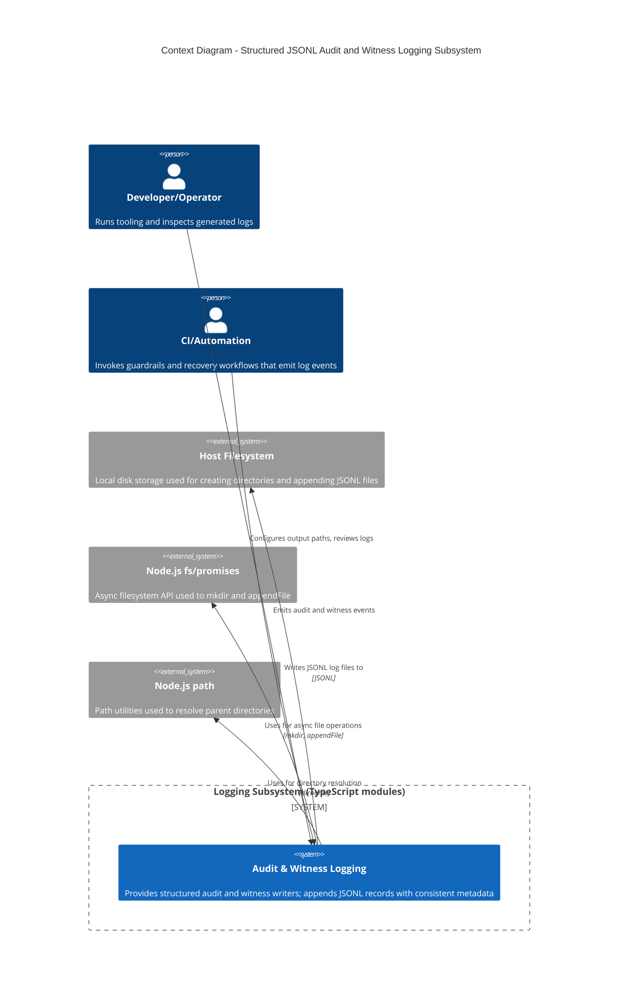

<!-- Generated by StrongAIAutoDoc 20260523 -->

This TypeScript logging subsystem provides consistent, append-only JSON Lines (JSONL) writers for operational traceability in guardrail and Git-state workflows. It enriches events with standard metadata (timestamp, version, repository) and persists them to local log files. It is primarily used by automated tooling such as CI checks, guardrail enforcement scripts, and repository recovery utilities. It interacts with the host filesystem to create directories and append log entries reliably.

Key components and external interactions center on reliable local persistence. The subsystem is invoked by CI/automation and by developers running guardrail or recovery tooling; both produce events that must be appended without truncation. AuditWriter standardizes guardrail-oriented records (findings, bypasses, exemptions, mode changes) and always injects timestamp, version, and repository metadata. WitnessWriter captures recovery-oriented Git state “witness” events with the same metadata enrichment. Both delegate persistence to JsonlWriter, which ensures the log directory exists and appends one JSON object per line. JsonlWriter depends on Node.js fs/promises (mkdir, appendFile) and path (dirname), and ultimately writes to the host filesystem.