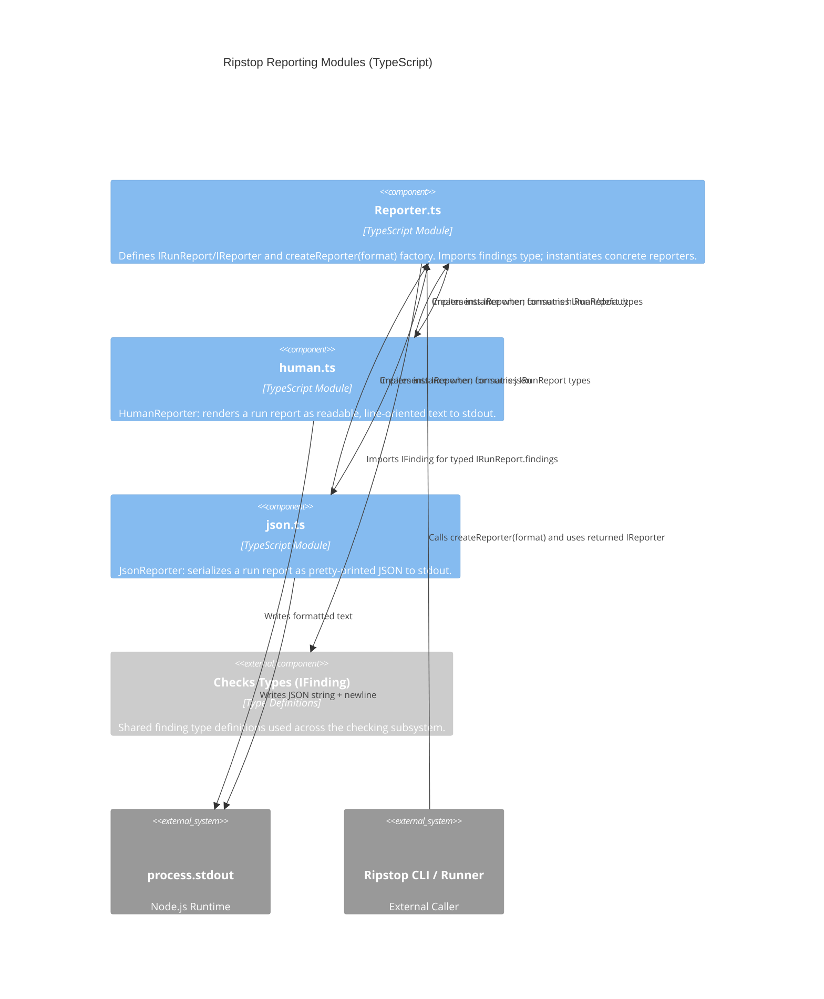

<!-- Generated by StrongAIAutoDoc 20260523 -->

This directory implements Ripstop’s reporting layer for CLI check runs. It defines the common data model and reporter contract, selects an output format, and provides two concrete renderers. The human reporter produces concise, line-oriented terminal text suitable for developers and CI logs, while the JSON reporter emits a stable, machine-readable serialization for automation. Together, these modules standardize how findings and summary counts are printed to standard output.

### Key components
**Reporter.ts** is the directory’s hub: it defines **IRunReport** (findings plus enforced failure/warning counts) and the **IReporter** interface, then exposes **createReporter(format)** to choose an implementation. It also imports **IFinding** from the checks type definitions to keep report payloads consistent across the system. **HumanReporter (human.ts)** implements IReporter by converting each finding into a readable block (severity, check name, location, message, rule) and printing a final summary. **JsonReporter (json.ts)** implements IReporter by emitting the entire report via `JSON.stringify` with indentation. Both reporters write to **process.stdout**.