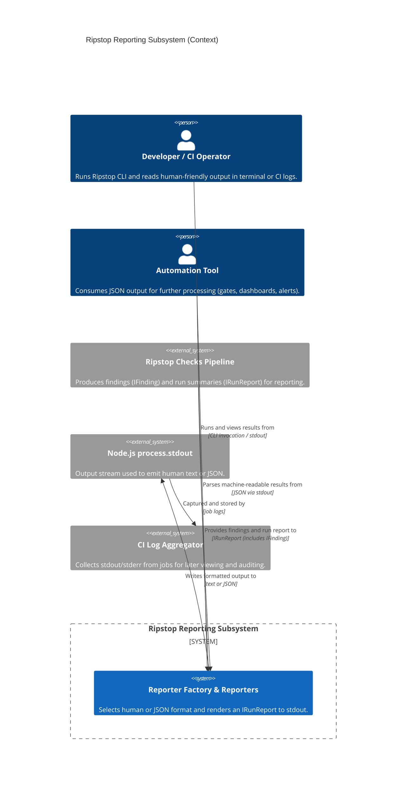

<!-- Generated by StrongAIAutoDoc 20260523 -->

Ripstop’s reporting subsystem turns completed check-run results into readable outputs for either humans or automation. It accepts a standardized run report containing findings and summary counts, selects a reporter format, and writes the rendered result to standard output. The primary users are developers and CI operators reading terminal logs, plus downstream tools that parse JSON output. It also interacts with the broader Ripstop checking pipeline that produces findings.

The subsystem depends on the upstream Ripstop checks pipeline to supply a complete IRunReport containing findings (typed via IFinding) plus enforced failure and warning counts. It then uses the Reporter factory to choose HumanReporter or JsonReporter based on a format selector, defaulting to human output. Both reporters write exclusively to Node.js process.stdout, making the output usable in local terminals and CI environments. HumanReporter formats concise, line-oriented blocks per finding and a final summary. JsonReporter serializes the full report as indented JSON with a trailing newline for reliable piping into other tools.